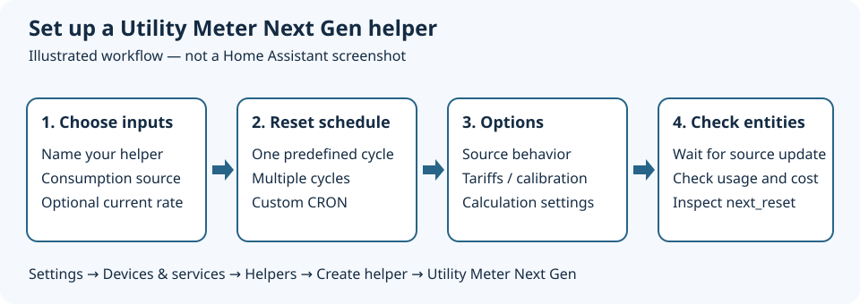

# Getting started

[All guides](README.md) · [Next: consumption meters](consumption.md)

## Install and open the helper

1. In **HACS**, search for **Utility Meter Next Gen** and download it. If it is not listed, add `cabberley/utility_meter_evolved` as a custom repository of type **Integration**.
2. Restart Home Assistant.
3. Open **Settings → Devices & services → Helpers → Create helper**.
4. Select **Utility Meter Next Gen**, rather than the built-in **Utility Meter**.

No `utility_meter:` YAML block is needed for these UI-created meters.

## Choose your source

Open **Developer tools → States** and check the source's state, unit, device class, and recent history.

| You want to measure | Suitable input | Do not use directly |
| --- | --- | --- |
| Electricity consumption | Cumulative energy in Wh, kWh, or MWh | Power in W or kW |
| Water consumption | Cumulative volume in L or m³ | Flow in L/min |
| Gas consumption | Cumulative volume in m³, or energy in kWh | A price or instantaneous rate |
| Consumption per report | A numeric amount since the last report | A cumulative total with Delta Values enabled |

For cumulative readings, `total` or `total_increasing` is usually the appropriate source state class. The source picker filters sensors by supported device classes; an entity without suitable metadata may not appear. Numeric readings are required: put the unit in `unit_of_measurement`, not in a state such as `12 kWh`.

If you only have power, first create Home Assistant's **Integral** helper (Riemann sum integration) to convert power into accumulated energy, then use that energy entity here. Check its units and accuracy before metering.

## Setup flow

*Illustration, not a Home Assistant screenshot.*

On the first form:

| Field | What to enter |
| --- | --- |
| **New Sensor Name** | A descriptive name, such as `House electricity` |
| **Input sensor for Metering** | Your consumption source |
| **Input Calculation Sensor** | Optional numeric `sensor` or `input_number` containing a rate per consumption unit |
| **Configuration type** | One predefined cycle, a custom CRON pattern, or multiple predefined cycles |

After submitting:

- **Predefined:** choose one reset cycle, then configure the common options.
- **CRON:** enter a reset pattern, then configure the common options.
- **Multiple:** select the cycles first, then submit to configure the common options and calibration targets.

Calculation-specific setup fields appear when a calculation input is selected.

## Common options

| Setting | Meaning and recommendation |
| --- | --- |
| **Delta Values** | Off for cumulative readings. On only when every report is a new amount to add. |
| **Net Consumption** | Allows negative consumption changes. Leave off for a normal import-only meter; do not enable merely because the source resets. |
| **Periodically resetting** | On if the source can reset to zero (for example, on device reboot). Off for a lifetime counter that never resets; this allows comparison with the last valid reading across an unavailable interval. |
| **Sensor always available** | Keeps the last known value when the source is unavailable. It does not recover missing readings or prove the value is current. |
| **Tariffs** | Leave empty for one uninterrupted meter, or add tariff names during creation. See [tariffs](tariffs.md). |
| **Calibration Value for Consumption** | Starting consumption value for each cycle, normally `0`. Not a schedule offset. |
| **Calibration Sensor for Consumption** | Optional `sensor`/`input_number` used instead of the fixed consumption calibration. |
| **Create a separate Calculation Sensor** | Exposes the accumulated calculation as its own entity, useful for cards and charts. Without it, the calculation remains a consumption sensor attribute. |
| **Adjustment factor for the calculation sensor** | Aligns source and rate units. Usually `1`; see [cost conversions](costs.md#units-and-adjustment-factor). |
| **Calibration Value / Sensor for Calculation** | Starting calculated value for each cycle; useful for a standing charge. |

The defaults are Delta Values off, Net Consumption off, Periodically resetting on, Sensor always available on, calculation sensor creation off, calibration `0`, and adjustment factor `1`.

The **Offset** field on a single predefined meter changes reset timing, not the meter's starting consumption. Seconds are ignored. Multiple-cycle configurations have no offset; use [CRON](schedules.md) for an explicit billing date.

## Check the result

1. Find the created entities under **Settings → Devices & services → Entities**, filtering by the integration or helper name.
2. Open **Developer tools → States** and inspect the consumption entity.
3. Wait for the source to report a new value. For a cumulative source, a change from `1000.0` to `1000.4` should add `0.4` to the meter, not `1000.4`.
4. Check `status`, `last_period`, and `next_reset`. If a calculation input was selected, also check `current_period_calculated_value`.
5. Add the resulting entities to a dashboard using an Entities or History graph card.

The initial period is partial if you create the helper mid-cycle. After a scheduled reset, `last_period` holds the previous period and the new cycle starts from its calibration value.
