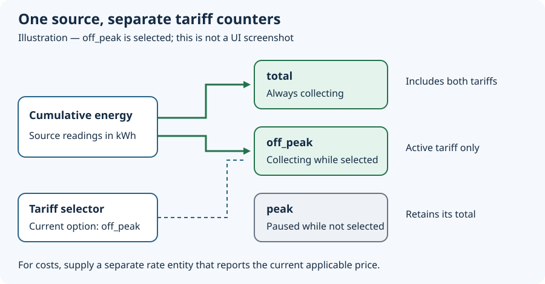

# Peak/off-peak tariffs

[All guides](README.md) · [Cost meters](costs.md) · [Multiple cycles](multiple-cycles.md)

## Create tariff meters

**Goal:** track daily peak, off-peak, and total energy from one cumulative source.

1. Create a **Utility Meter Next Gen** helper named `Electricity tariffs`.
2. Select your cumulative import energy source.
3. Optionally select a calculation input that reports the **current** price.
4. Choose **Create using a Predefined reset cycle** and submit.
5. Choose **Daily** with zero offset.
6. Add `peak`, `off_peak`, and `total` to **Tariffs**. Use unique names; putting a normal tariff first also avoids starting with `total` as the initial selection.
7. Leave Delta Values and Net Consumption off for a cumulative import sensor, and set Periodically resetting to match the source.
8. If using prices, enable **Create a separate Calculation Sensor** and set the [adjustment factor](costs.md#units-and-adjustment-factor).
9. Leave consumption and calculation calibration at `0`, with calibration entity selections empty; see the standing-charge limitation below.
10. Submit and find the sensors and `select` entity Home Assistant creates.

Use lowercase `total` for consistency. It is special (case-insensitive): it collects continuously and is excluded from the tariff selector. Select `peak` or `off_peak`, not `total`.

## How the sensors work



*Illustration, not a Home Assistant screenshot.*

| Entity | Behavior |
| --- | --- |
| Peak consumption sensor | Collects while `peak` is selected |
| Off-peak consumption sensor | Collects while `off_peak` is selected |
| Total consumption sensor | Collects regardless of the selected tariff |
| Tariff `select` entity | Chooses the active normal tariff |
| Optional Calculated sensors | Expose the accumulated calculated value for each meter |

Inactive tariff sensors having `status: paused` is normal. With multiple cycles, **one selector controls all cycles**, not a selector per cycle.

Tariff names do not define rates or switching times. If you select a calculation input, it must report the appropriate current rate; changing the selector does not automatically change that entity's value.

## Switch manually first

1. Open **Developer tools → Actions**.
2. Choose **Select: Select option** (`select.select_option`).
3. Target the integration's tariff selector and choose `peak`.
4. Wait for a source increase; check that peak and total collect it.
5. Choose `off_peak` and verify that off-peak and total collect the next increase while peak pauses.

## Automate a fixed schedule

This example assumes off-peak starts at **00:30** and peak starts at **07:30** every day. Replace these times and the selector ID with your supplier's actual schedule and your created entity.

In **Settings → Automations & scenes → Create automation**, open the YAML editor and use:

```yaml
alias: Electricity tariff schedule
triggers:
  - trigger: time
    at: "00:30:00"
  - trigger: time
    at: "07:30:00"
  - trigger: homeassistant
    event: start
actions:
  - action: select.select_option
    target:
      entity_id: select.electricity_tariffs
    data:
      option: >-
        
        {{ 'off_peak' if 30 <= minutes < 450 else 'peak' }}
mode: single
```

The startup trigger restores the correct tariff after Home Assistant restarts outside a switching time. The template selects off-peak from 00:30 inclusive to 07:30 exclusive in Home Assistant's local time.

For schedules that vary by weekday, season, or supplier events, use an automation based on those rules or your supplier's tariff-status entity instead. If the rate comes from a separate entity, arrange for it to reflect the tariff before the next consumption update.

## Check totals and charges

Starting from zero, collect `1 kWh` on peak, switch, then collect `2 kWh` off-peak. Expect peak `1`, off-peak `2`, and total `3 kWh`.

Do not add the total sensor to the individual tariff sensors: it already includes their consumption.

**Standing-charge limitation:** the current implementation passes calibration to individual tariff meters as well as `total` at initialization/reset, even though individual tariff attributes do not display that calibration. A nonzero charge can therefore appear in every tariff counter and make their sum misleading.

Keep tariff calibration at zero. For a cost including the daily standing charge, create a separate **tariff-free daily cost helper** using the same consumption source and current-rate entity, then follow the [standing-charge setup](costs.md#add-a-daily-standing-charge). For a `0.60` charge and consumption costs of `0.50`, that helper shows `1.10`; the tariff costs remain consumption-only and sum to `0.50`.

At boundaries, a consumption increment is assigned using the active tariff when the source reports. Sparse source readings can cross a switching time; the meter cannot divide that increment retrospectively.

## Change tariffs later

Open the helper's options to edit the tariff list on an existing tariff-based meter. Update automations to match any renamed or removed options, and verify the active selection afterward.

If the meter was created without tariffs, create a new tariff-based helper; adding tariffs to a previously tariff-free configuration is not supported by the options flow. Removing entities or tariffs does not migrate their historical totals into new ones.
